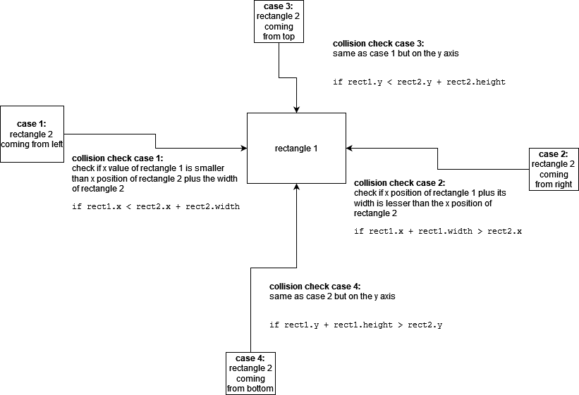

# How to detect collision

### Collision detection in the `<canvas>`:

All our images are placed in the canvas using the `context.drawImage()` function. Inherently this means that all our images are contained in rectangular or squared boxes. We can call these Bounding Boxes.

This is important because you might have an image from a spritesheet that does not look rectangular or square but it is contained within a bounding box, we can program conditionals to detect these boxes, it would be much harder to write conditionals that accommodate for the much more organic edges and shapes of our game artwork. 

When thinking about how to program for collision between two objects, we must plan for edges of two boxes touching (or colliding) as well as the surfaces covered by both bounding boxes.

We can break the process into 4 steps, for each edge of our rectangles:
* collision on the left edge
* collision on the right edge
* collision on the top edge
* collision on the bottom edge




```
if (rect1.x < rect2.x + rect2.width && 
    rect1.x + rect1.width > rect2.x && 
    rect1.y < rect2.y + rect2.height &&
    rect1.y + rect1.height > rect2.y) 
    {
        collision detected!
    }
    )
```

### sources 
* https://developer.mozilla.org/en-US/docs/Games/Techniques/2D_collision_detection
* https://www.codegrepper.com/code-examples/javascript/javascript+box+collision

